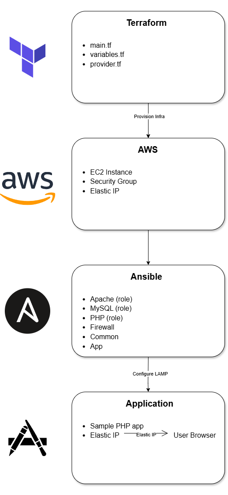

# CloudLAMP Automation 🚀 
[](https://github.com/Yagna3903/CloudLAMP-Automation/actions)  
  
  


**One-click Cloud LAMP Deployment**  

This project provisions **AWS infrastructure** using **Terraform**, configures a full **LAMP stack** (Linux, Apache, MySQL, PHP) with **Ansible**, and deploys a sample PHP application.  

### Designed as a **Cloud + DevOps project** to demonstrate:  
- Infrastructure as Code (Terraform)  
- Automated server configuration (Ansible)  
- Cloud deployment (AWS EC2)  
- CI/CD & GitHub Actions integration  

---

## 📌 Features
- **Infrastructure as Code** – reproducible AWS environments.  
- **Automated LAMP stack** – Apache, MySQL, PHP setup in minutes.  
- **Idempotent configuration** – safe re-runs with Ansible.  
- **CI/CD ready** – integrated GitHub Actions for lint/test.  
- **Documentation & diagrams** for easy onboarding.  

---

## 🏗️ Architecture
Terraform provisions -> AWS EC2 + SG + EIP  
Ansible configures -> Apache + MySQL + PHP  
App deployed -> Accessible via Elastic IP.  



### More details in [docs/architecture.md](docs/architecture.md).  

---

## ⚡ Quickstart (5-min demo)
```bash
# 1. Clone repo
git clone https://github.com/Yagna3903/CloudLAMP-Automation.git
cd CloudLAMP-Automation

# 2. Provision infra with Terraform
cd terraform
terraform init
terraform apply -auto-approve

# 3. Configure server with Ansible
cd ../ansible
ansible-playbook -i inventory.ini playbook.yml

# 4. Visit your Elastic IP in browser 🎉
```
## Full guide → [docs/setup-guide.md](docs/setup-guide.md)

---
